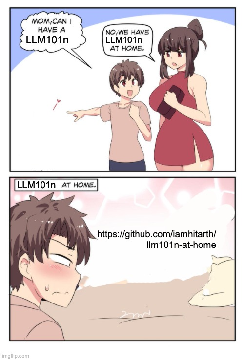

# LLM101n at Home

While [Andrej Karpathy](https://twitter.com/karpathy) and the fine folks at [Eureka Labs](https://eurekalabs.ai/)  are busy building out "the worlds obviously best LLM course" at [LLM101n](https://github.com/karpathy/LLM101n) - I've taken the outline for that course and decided to build an "at home" version using assistance from LLMs for others like me who can't wait for the real thing.

Start with [Chapter 1](./01/notes.md) and go from there.

__Disclaimer:__ I'm not a ML Engineer and could easily be getting duped by the LLMs so any  feedback and contributions are welcome!

Hit me up on [Twitter](https://twitter.com/iamhitarth) or [LinkedIn](https://www.linkedin.com/in/hitarthsharma/). 